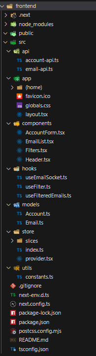
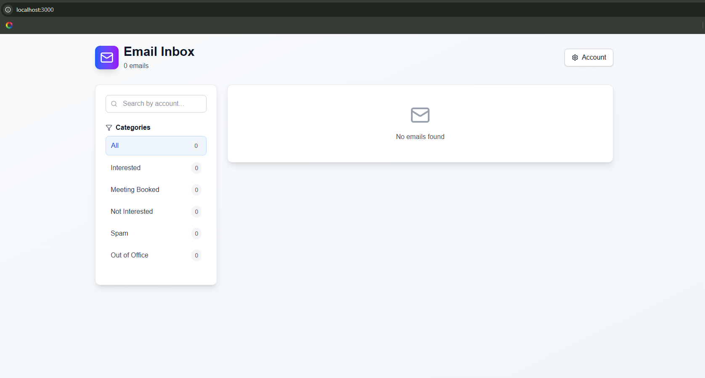
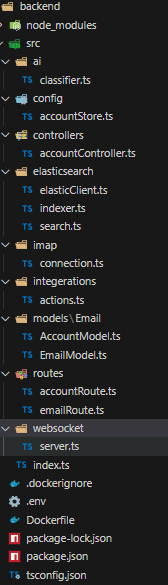
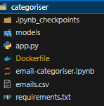

# 📧 Real-Time Email Synchronizer with AI Categorization

A full-stack TypeScript-based application that syncs multiple email accounts in real-time using IMAP IDLE, stores them in Elasticsearch, applies AI-based categorization, and supports integrations with Slack and external webhooks. It also includes a simple frontend for email browsing and filtering.

---

## 🚀 Features

### ✅ 1. Real-Time Email Synchronization
- Syncs multiple IMAP email accounts (minimum 2).
- Fetches last 30 days of emails.
- Uses **persistent IDLE connections** for real-time updates (no cron jobs).
- Email sync powered by `imapflow`.

### 🔎 2. Searchable Email Storage
- Stores emails in a local **Elasticsearch** instance.
- Indexed for fast, filtered, and full-text search.
- Supports filtering by **email folder** and **account**.

### 🤖 3. AI-Based Email Categorization
- Categorizes each email using a trained AI model into:
  - `Interested`
  - `Meeting Booked`
  - `Not Interested`
  - `Spam`
  - `Out of Office`
- Built using Python and served via a REST API in the `categoriser` microservice.

### 🔔 4. Slack & Webhook Integration
- Sends Slack notifications for `Interested` emails.
- Triggers [webhook.site](https://webhook.site/) webhook for automation on `Interested` email detection.

### 🖥️ 5. Frontend Interface
- Built with **Next.js (TypeScript)**.
- Displays categorized emails with filters for folders and accounts.
- Integrates real-time updates via **WebSocket**.
- Supports search using Elasticsearch queries.

---

## 📁 Project Structure

### Frontend




### Backend


### Categoriser (AI Microservice)



## 🧠 Tech Stack

| Layer       | Tech                         |
|------------|------------------------------|
| Frontend   | React (Next.js), TypeScript, Redux |
| Backend    | Node.js, Express, TypeScript |
| Realtime   | WebSocket                     |
| Email Sync | imapflow                      |
| Storage    | Elasticsearch (Dockerized)   |
| AI         | Python, Scikit-learn, Flask  |
| Integrations | Slack API, Webhook.site     |

---


## 🧪 Running the Project

### Prerequisites
- Node.js v18+
- Docker & Docker Compose
- Python 3.10+

### 1. Start All Services Using Docker Compose

From the project root:
```bash
docker-compose up --build
This will spin up:

backend - Node.js API server

categoriser - Python-based AI categorization service

elasticsearch - Email indexing engine

2. Run Frontend Separately
bash
Always show details

Copy
cd frontend
npm install
npm run dev